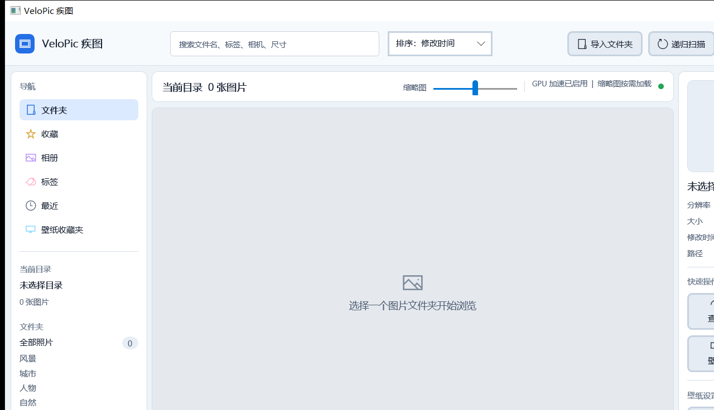

# VeloPic 疾图

VeloPic 是一款面向 Windows 10/11 的本地图片浏览与整理工具。应用使用 WinUI 3 构建，支持大目录递归扫描、虚拟化缩略图、筛选排序、收藏与相册、壁纸管理，以及完全离线的图片智能分类。

[在浏览器中打开 VeloPic 动态产品介绍页](https://wangjingping-88.github.io/VeloPic/)



## 主要功能

- 递归扫描本地图片目录，识别 JPG、PNG、WebP、BMP、GIF、TIFF、HEIC、AVIF 等格式。
- 使用虚拟化网格按需加载缩略图，可通过滑块调整缩略图尺寸。
- 按文件名、分辨率和当前目录中的文件类型组合筛选。
- 按修改时间、文件名或文件大小排序，支持升序、降序及状态持久化。
- 支持收藏、相册、壁纸收藏夹、最近图片和自定义分类。
- 使用本地 ONNX 模型智能分类为风景、城市、人物、自然，不上传图片。
- 提供沉浸式查看器、滚轮缩放、拖拽平移和前后图片切换。
- 支持填充、适中、居中三种桌面壁纸显示方式。
- 实时显示 CPU、内存和 GPU 使用率。
- 支持跟随系统、深色和浅色主题。

## 查看器操作

| 操作 | 行为 |
| --- | --- |
| 双击缩略图或点击“查看” | 打开查看器 |
| `Esc` | 返回主界面 |
| `←` / 鼠标左键单击 | 上一张 |
| `→` / 鼠标右键单击 | 下一张 |
| 鼠标滚轮 | 缩放图片 |
| 放大后按住鼠标左键拖动 | 平移图片 |
| 查看器打开时点击窗口关闭按钮 | 先退出查看器，不关闭应用 |

## 技术栈

- .NET 8 / C# 12
- WinUI 3
- Windows App SDK 2.2
- ONNX Runtime + SqueezeNet（本地智能分类）
- Windows Shell、PDH、注册表与桌面壁纸 Win32 API

项目采用两层结构，界面事件只负责协调控件与核心服务：

```text
src/
├─ VeloPic.App/
│  ├─ MainWindow.xaml.cs          图库加载、筛选控件和状态协调
│  ├─ MainWindow.Categories.cs    分类、智能分类和导航
│  ├─ MainWindow.Collections.cs   收藏、相册和壁纸集合交互
│  ├─ MainWindow.Viewer.cs        详情面板和查看器输入
│  └─ MainWindow.Windowing.cs     窗口、主题、布局与 Win32 集成
└─ VeloPic.Core/
   ├─ ImageLibraryQueryService    组合筛选与排序
   ├─ ImageCollectionService      收藏、相册和壁纸收藏状态
   ├─ ImageViewerNavigator        查看器序列与首尾循环
   ├─ ImageFileScanner            可取消的安全目录扫描
   └─ SettingsStore               设置规范化与原子保存
tests/
└─ VeloPic.Core.Tests/  无第三方测试框架的核心回归测试
scripts/
├─ run-velopic.ps1       构建并运行应用
└─ generate-app-icon.ps1 重新生成多尺寸应用图标
```

## 环境要求

- Windows 10 1809（Build 17763）或更高版本
- x64 处理器
- .NET 8 SDK

项目启用了 `WindowsAppSDKSelfContained`，构建输出会携带 Windows App SDK 运行组件，不要求目标电脑另行安装匹配版本的 Windows App Runtime。

本仓库约定开发依赖位于 `D:\Program Files`：

```powershell
$env:NUGET_PACKAGES = 'D:\Program Files\NuGet\packages'
& 'D:\Program Files\dotnet\dotnet.exe' --version
```

## 构建与运行

在仓库根目录执行：

```powershell
.\scripts\run-velopic.ps1
```

只构建、不启动：

```powershell
.\scripts\run-velopic.ps1 -BuildOnly
```

直接使用 .NET CLI：

```powershell
$env:NUGET_PACKAGES = 'D:\Program Files\NuGet\packages'
& 'D:\Program Files\dotnet\dotnet.exe' build .\src\VeloPic.App\VeloPic.App.csproj `
  -c Debug -p:Platform=x64
```

## 测试

```powershell
$env:NUGET_PACKAGES = 'D:\Program Files\NuGet\packages'
& 'D:\Program Files\dotnet\dotnet.exe' run `
  --project .\tests\VeloPic.Core.Tests\VeloPic.Core.Tests.csproj -c Release
```

测试覆盖扩展名识别、递归与非递归扫描、扫描取消、主题解析、分辨率筛选、组合查询与排序、集合服务、查看器导航、设置往返保存、集合删除持久化及原子保存。

## 发布

生成自包含的 x64 发布目录：

```powershell
$env:NUGET_PACKAGES = 'D:\Program Files\NuGet\packages'
& 'D:\Program Files\dotnet\dotnet.exe' publish .\src\VeloPic.App\VeloPic.App.csproj `
  -c Release -r win-x64 --self-contained true -p:Platform=x64 `
  -o .\artifacts\publish\win-x64
```

发布前建议依次执行测试、`-BuildOnly` 构建检查，再在浅色、深色主题下完成一次手工冒烟验证。

## 本地数据

VeloPic 不建立独立图片副本，收藏、相册和分类保存的是原文件路径。

| 数据 | 位置 |
| --- | --- |
| 设置、收藏、相册和分类 | `%LOCALAPPDATA%\VeloPic\settings.json` |
| 启动与异常日志 | `%LOCALAPPDATA%\VeloPic\logs\startup.log` |
| 智能分类模型 | 应用目录下 `Assets\Models` |

设置文件采用临时文件写入后原子替换，降低异常退出造成配置损坏的风险。日志超过 2 MB 后会轮换为 `startup.previous.log`。

## 性能设计

- 文件扫描、分辨率读取和智能分类均在后台执行，避免阻塞界面线程。
- 新扫描会取消旧扫描，窗口关闭会取消后台元数据读取和分类任务。
- `GridView + ItemsWrapGrid` 提供容器虚拟化；缩略图按目标宽度解码，避免加载原始大图。
- 输入筛选和缩略图滑块使用短延迟合并更新，减少连续输入时的列表重建和磁盘写入。
- 首批最多创建 2000 个缩略图视图模型；更大的目录可通过筛选缩小结果范围。

## 智能分类说明

智能分类不需要大模型服务或网络连接。应用随包提供轻量 SqueezeNet 模型，在本机完成推理，并根据 ImageNet 标签映射到四个内置类别。它适合辅助整理，不等同于通用视觉大模型；低置信度图片可能保持未分类，已有手动分类不会被覆盖。

## 已知限制

- 当前只发布 `win-x64`，尚未提供 ARM64 构建。
- HEIC、HEIF、AVIF 等格式的实际显示能力取决于 Windows 上可用的图像解码器。
- 智能分类目前只映射到风景、城市、人物、自然四个内置类别，自定义类别需要手动标记。

## 应用图标

图标源文件位于 `src/VeloPic.App/Assets`。修改图标生成脚本后可重新生成 PNG 与多尺寸 ICO：

```powershell
.\scripts\generate-app-icon.ps1
```

项目会将 ICO 嵌入 `VeloPic.App.exe`，并在窗口创建时为标题栏和任务栏设置同一图标。
